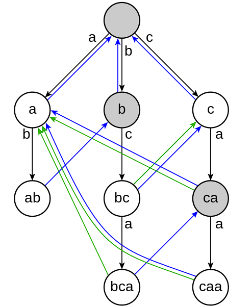

<a name="readme-top"></a>

[![Contributors][contributors-shield]][contributors-url]
[![Forks][forks-shield]][forks-url]
[![Stargazers][stars-shield]][stars-url]
[![Issues][issues-shield]][issues-url]
[![MIT License][license-shield]][license-url]
[![LinkedIn][linkedin-shield]][linkedin-url]

<br />
<div align="center">
  <a href="https://github.com/jamestkelly/aho-corasick">
    
  </a>

<h3 align="center">aho-corasick</h3>

  <p align="center">
    An implementation of the Aho-Corasick algorithm in TypeScript.
    <br />
    <a href="https://github.com/jamestkelly/aho-corasick"><strong>Explore the docs »</strong></a>
    <br />
    <br />
    <a href="https://github.com/jamestkelly/aho-corasick">View Demo</a>
    ·
    <a href="https://github.com/jamestkelly/aho-corasick/issues">Report Bug</a>
    ·
    <a href="https://github.com/jamestkelly/aho-corasick/issues">Request Feature</a>
  </p>
</div>

<!-- TABLE OF CONTENTS -->
<details>
  <summary>Table of Contents</summary>
  <ol>
    <li>
      <a href="#about-the-project">About The Project</a>
      <ul>
        <li><a href="#built-with">Built With</a></li>
      </ul>
    </li>
    <li>
      <a href="#getting-started">Getting Started</a>
      <ul>
        <li><a href="#installation">Installation</a></li>
      </ul>
    </li>
    <li>
      <a href="#usage">Usage</a>
      <ul>
        <li>
          <a href="#create-trie-and-add-keywords">
            Create <code>Trie</code> and Add Keywords
          </a>
        </li>
        <li>
          <a href="#get-matches">
            Get <code>Matches</code>
          </a>
        </li>
        <li>
          <a href="#get-inverse-matches">
            Get Inverse <code>Matches</code>
          </a>
        </li>
        <li><a href="#get-string-occurrences">Get String Occurrences</a></li>
      </ul>
    </li>
    <li><a href="#roadmap">Roadmap</a></li>
    <li><a href="#contributing">Contributing</a></li>
    <li><a href="#license">License</a></li>
    <li><a href="#contact">Contact</a></li>
    <li><a href="#acknowledgments">Acknowledgments</a></li>
  </ol>
</details>

<!-- ABOUT THE PROJECT -->

## About The Project

<div align="center">
  <a href="https://en.wikipedia.org/wiki/Aho%E2%80%93Corasick_algorithm">
      
  </a>
  <p>
      <b>Figure 1:</b> Aho-Corasick Algorithm Diagram 
      <a href="https://en.wikipedia.org/wiki/Aho%E2%80%93Corasick_algorithm">
          [1]
      </a>
  </p>
</div>

The Aho—Corasick algorithm is a [string-searching algorithm](https://en.wikipedia.org/wiki/String-searching_algorithm) invented by Alfred V. Aho and Margaret J. Corasick in 1975. [\[1\]](https://en.wikipedia.org/wiki/Aho%E2%80%93Corasick_algorithm). This repository contains an implementation of this algorithm in TypeScript for use in efficient string matching as an aid to bibliographic searches.

This package is referenced and inspired from [tanishiking's aho-corasick-js](https://github.com/tanishiking/aho-corasick-js) package, providing some minor improvements to optimisation and additional functionality.

<p align="right">(<a href="#readme-top">back to top</a>)</p>

### Built With

- [![TypeScript][TypeScript.ts]][TypeScript-url]

<p align="right">(<a href="#readme-top">back to top</a>)</p>

<!-- GETTING STARTED -->

## Getting Started

### Installation

To use this project, please install the required packages as available from `npm`.

- npm
  ```sh
  npm install @jamestkelly/aho-corasick
  ```

<!-- USAGE EXAMPLES -->

## Usage

### Create `Trie` and Add Keywords

It's important to note that if the `param`, `keywords` is an array of empty strings, e.g., `[' ', '']`, then an error will be thrown.

```typescript
const trie = new Trie();
trie.addKeyword('apple');
trie.addKeyword('banana');
```

### Get `Matches`

```typescript
const trie = new Trie(['apple', 'banana']);
const matches = trie.getMatches('apple banana');
console.log(matches);
// Output: [{ start: 0, end: 4, keyword: 'apple' }, { start: 6, end: 11, keyword: 'banana' }]
```

### Get Inverse `Matches`

```typescript
const trie = new Trie(['cat', 'dog']);
const nonMatches = trie.getNonMatches('The cat and the dog');
console.log(nonMatches);
// Output: ['The ', ' and the ']
```

### Get String Occurrences

```typescript
const trie = new Trie(['apple', 'banana']);
const occurrences = trie.getStringOccurrences('apple banana apple');
console.log(occurrences);
// Output: [{ keyword: 'apple', occurrences: 2 }, { keyword: 'banana', occurrences: 1 }]
```

_For more examples, please refer to the [Documentation](https://github.com/jamestkelly/aho-corasick/blob/main/doc/examples.ts)_

<p align="right">(<a href="#readme-top">back to top</a>)</p>

<!-- ROADMAP -->

## Roadmap

- [x] Base implementation of the Aho-corasick algorithm.
- [x] Add GitHub workflow to test & build the package.
- [x] Implement feature to return `non-matches`, i.e., all words that _did not match_.
  - [x] Additional nice to have is to only return the words that matched and their counts, i.e., without position in the string.

See the [open issues](https://github.com/jamestkelly/aho-corasick/issues) for a full list of proposed features (and known issues).

<p align="right">(<a href="#readme-top">back to top</a>)</p>

<!-- CONTRIBUTING -->

## Contributing

Contributions are what make the open source community such an amazing place to learn, inspire, and create. Any contributions you make are **greatly appreciated**.

If you have a suggestion that would make this better, please fork the repo and create a pull request. You can also simply open an issue with the tag "enhancement".
Don't forget to give the project a star! Thanks again!

1. Fork the Project
2. Create your Feature Branch (`git checkout -b feature/AmazingFeature`)
3. Commit your Changes (`git commit -m 'Add some AmazingFeature'`)
4. Push to the Branch (`git push origin feature/AmazingFeature`)
5. Open a Pull Request

<p align="right">(<a href="#readme-top">back to top</a>)</p>

<!-- LICENSE -->

## License

Distributed under the MIT License. See `LICENSE.txt` for more information.

<p align="right">(<a href="#readme-top">back to top</a>)</p>

<!-- CONTACT -->

## Contact

Jim Kelly - [jimkelly.t@outlook.com](mailto:jimkelly.t@outlook.com)

Project Link: [https://github.com/jamestkelly/aho-corasick](https://github.com/jamestkelly/aho-corasick)

<p align="right">(<a href="#readme-top">back to top</a>)</p>

<!-- ACKNOWLEDGMENTS -->

## Acknowledgments

- [aho-corasick-js | tanishking](https://github.com/tanishiking/aho-corasick-js)
- [Best-README-Template | othneildrew](https://github.com/othneildrew/Best-README-Template/tree/master)

<p align="right">(<a href="#readme-top">back to top</a>)</p>

<!-- MARKDOWN LINKS & IMAGES -->
<!-- https://www.markdownguide.org/basic-syntax/#reference-style-links -->

[contributors-shield]: https://img.shields.io/github/contributors/jamestkelly/aho-corasick.svg?style=for-the-badge
[contributors-url]: https://github.com/jamestkelly/aho-corasick/graphs/contributors
[forks-shield]: https://img.shields.io/github/forks/jamestkelly/aho-corasick.svg?style=for-the-badge
[forks-url]: https://github.com/jamestkelly/aho-corasick/network/members
[stars-shield]: https://img.shields.io/github/stars/jamestkelly/aho-corasick.svg?style=for-the-badge
[stars-url]: https://github.com/jamestkelly/aho-corasick/stargazers
[issues-shield]: https://img.shields.io/github/issues/jamestkelly/aho-corasick.svg?style=for-the-badge
[issues-url]: https://github.com/jamestkelly/aho-corasick/issues
[license-shield]: https://img.shields.io/github/license/jamestkelly/aho-corasick.svg?style=for-the-badge
[license-url]: https://github.com/jamestkelly/aho-corasick/blob/master/LICENSE.txt
[linkedin-shield]: https://img.shields.io/badge/-LinkedIn-black.svg?style=for-the-badge&logo=linkedin&colorB=555
[linkedin-url]: https://linkedin.com/in/jimkellyt
[product-screenshot]: doc/img/aho-corasick-diagram-wikipedia.png
[TypeScript.ts]: https://img.shields.io/badge/typescript-%23007ACC.svg?style=for-the-badge&logo=typescript&logoColor=white
[TypeScript-url]: https://www.typescriptlang.org/
